# Kubeflow
<p align="center">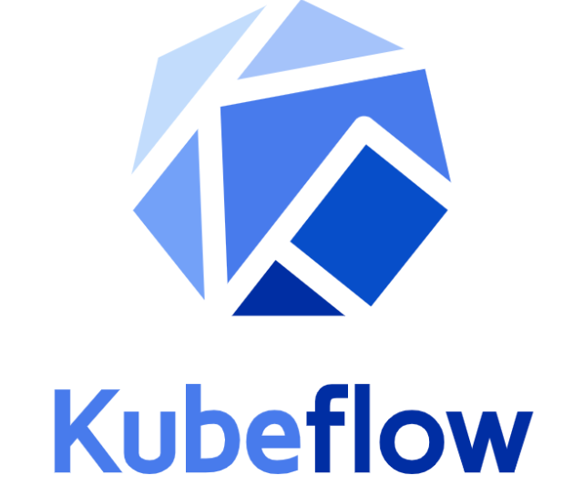</p>

The Kubeflow project is dedicated to making deployments of machine learning (ML) workflows on Kubernetes simple, portable and scalable. Our goal is not to recreate other services, but to provide a straightforward way to deploy best-of-breed open-source systems for ML to diverse infrastructures. Anywhere you are running Kubernetes, you should be able to run Kubeflow.

## Steps to create a VM in GCP
you can follow the next steps in your local machine but you have to have in it at least 16GB of RAM if you dont have it try using Google Cloud Platform. In this case we are going to create a Virtual Machine in GCP, where we are going to install kubeflow there. First create an user in GCP(Google Cloud Platform).<br>

Once you create your own account go to <b>Compute Engine</b> and create a new VM
<p align="center">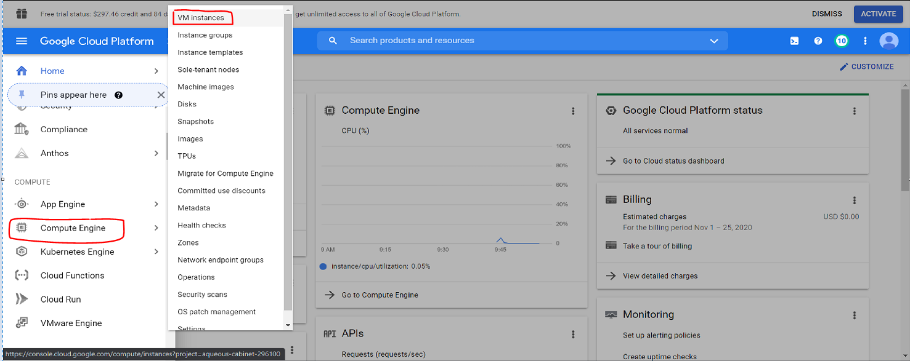</p>
<hr style="width:75%;>
<p align="center">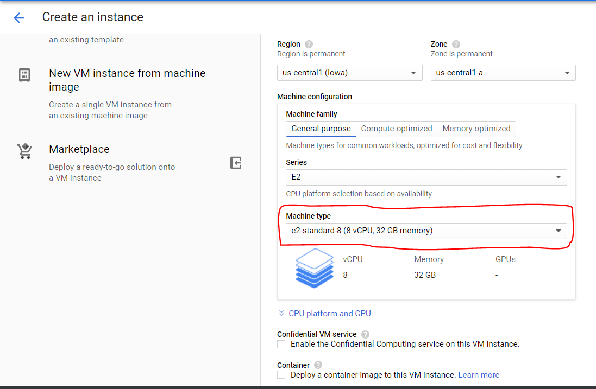</p>
<hr style="width:75%;>
<p align="center">Here we will change the OS, we will use Ubuntu version 18.04 and we are gonna give it 120 GB 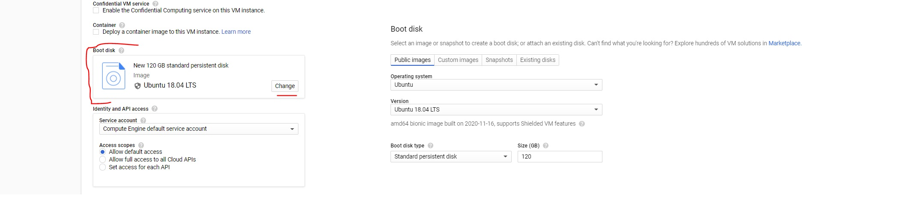</p>
<hr style="width:75%;>
If you want to add some <b>SSH Keys to you VM</b>, also remember to check both boxes
<p align="center">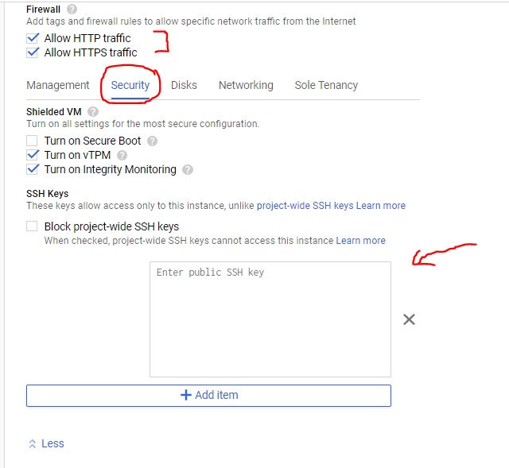</p>
<hr style="width:75%;>
<p align="center">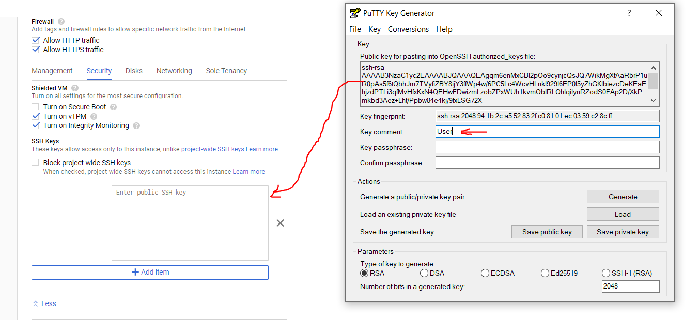</p>
<br>
<p>Once you have all the configuration done create the VM</p>
<br>
           
## Firewall Config
Go to Firewall and create a new rule
<p align="center">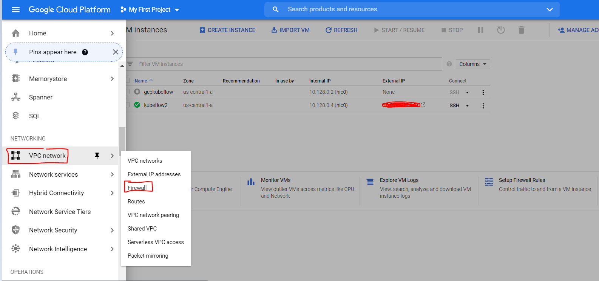</p>
<br>
<p align="center">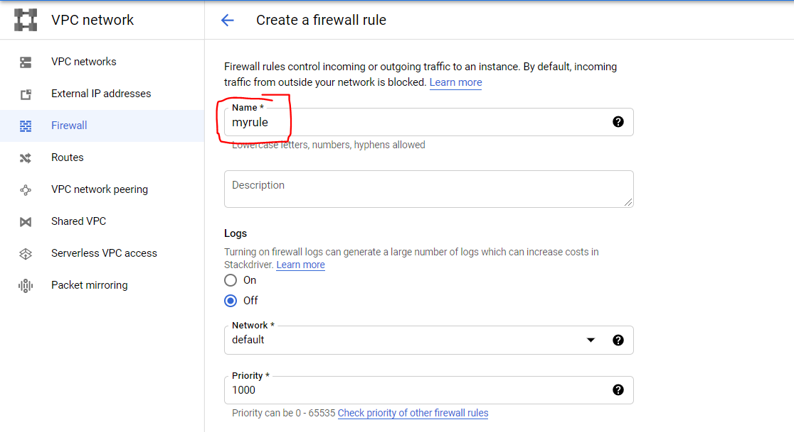</p>
<br>
<p align="center">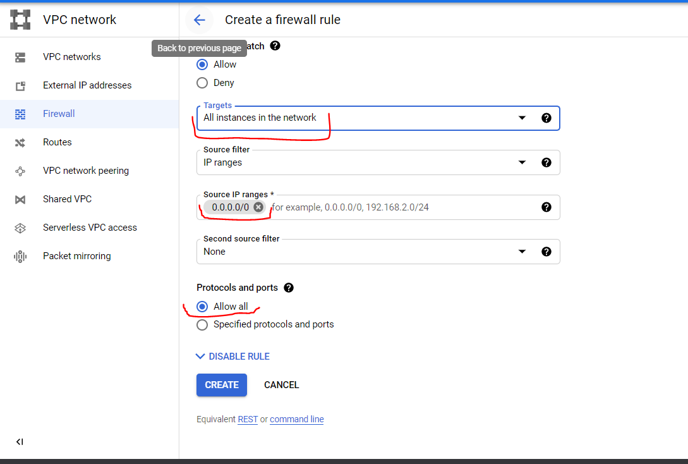</p>
<br>

create the rule and it automatically will be applied to the VM's in your network, This rule will help us to connect with Kubeflow later
<br>
<br>
## Create .pem with PuttyGen
if you want to create the .pem of you .ppk key with PuttyGen you can follow the next steps
First load your <b>Private key</b> then<br>
<p align="center">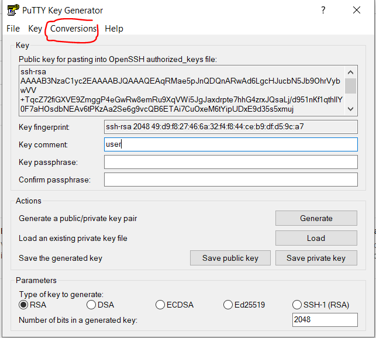</p>
<br>
<p align="center">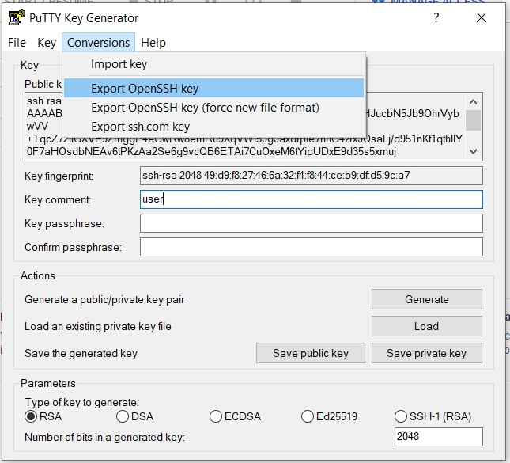</p>
<br>
click on Yes, and When you are going to save your file REMEMBER TO ADD .pem at the end of the name of your file now you will have your .pem file
<br>
<br>


## Installing Kubeflow in GCP
to enter in your VM you will need Putty or you can use SSH to access to your machine
#### Enter
```
ssh -i your_file.pem your_VM_user@your_VM_ip
```
#### Install Wget Package
```
sudo apt-get install wget
```
#### Install Docker
```
sudo apt-get update

sudo apt install --yes apt-transport-https ca-certificates curl gnupg2 software-properties-common

curl -fsSL https://download.docker.com/linux/ubuntu/gpg | sudo apt-key add -

sudo add-apt-repository \
   "deb [arch=amd64] https://download.docker.com/linux/ubuntu \
   $(lsb_release -cs) \
   stable"
   
sudo apt update

sudo apt install --yes docker-ce
```

Adding User to Docker Group, remeber logout and enter again to refresh the permissions
```
sudo usermod -aG docker $USER
logout
```

Testing Docker
```
docker run busybox date
```
#### Add GCP auth to Docker
```
gcloud auth configure-docker
```

#### Kubectl Installation
```
sudo apt-get update && sudo apt-get install -y apt-transport-https gnupg2 curl
curl -s https://packages.cloud.google.com/apt/doc/apt-key.gpg | sudo apt-key add -
echo "deb https://apt.kubernetes.io/ kubernetes-xenial main" | sudo tee -a /etc/apt/sources.list.d/kubernetes.list
sudo apt-get update
sudo apt-get install -y kubectl=1.14.10-00
```

#### Minikube Installation
```
curl -LO https://storage.googleapis.com/minikube/releases/latest/minikube_latest_amd64.deb
sudo dpkg -i minikube_latest_amd64.deb
```

#### kubernetes installation
you can change this configuration depending on your machine
```
minikube start \
    --cpus 5 \
    --memory 10288 \
    --disk-size 20gb \
    --kubernetes-version 1.14.10
```

#### Minikube start
Start minikube for first time, you will have to run this command everytime you start your VM to be able to access to your kubeflow later
```
minikube start
```
If you want to see the kubernetes Dashboard you can run the following command, this is something optional<br>
the second command will give you a token to access to the kubernetes platform so if you want you can save it in a file
```
kubectl apply -f https://raw.githubusercontent.com/kubernetes/dashboard/v2.0.0/aio/deploy/recommended.yaml

kubectl -n kube-system describe secret $(kubectl -n kube-system get secret | awk '/^deployment-controller-token-/{print $1}') | awk '$1=="token:"{print $2}'
```

to see the dashboard please:
* open another terminal without enter in your VM<br>
* copy the token (you have to copy all the spaces too)
* run `kubectl proxy` in the terminal inside your VM
* run `ssh -L 8001:localhost:8001 user_vm@ip_vm -i key_vm.pem` to create like a tunnel between your machine and the VM
* visit this url http://localhost:8001/api/v1/namespaces/kubernetes-dashboard/services/https:kubernetes-dashboard:/proxy in a browser in your local machine
* paste the token to access
* WELCOME TO KUBERNETES!!


#### Kubeflow installation
Create a file with name kf-1.0.sh with the next content
```
set -e

KF_PATH="$HOME/.kubeflow"
rm -fr $KF_PATH
mkdir -p $KF_PATH
cd $KF_PATH
wget https://github.com/kubeflow/kfctl/releases/download/v1.0/kfctl_v1.0-0-g94c35cf_linux.tar.gz -O kfctl_linux.tar.gz	

tar -xvf kfctl_linux.tar.gz	

export PATH=$PATH:$KF_PATH
export KF_NAME=my-kubeflow
export BASE_DIR=$KF_PATH
export KF_DIR=${BASE_DIR}/${KF_NAME}
export CONFIG_URI="https://raw.githubusercontent.com/kubeflow/manifests/v1.0-branch/kfdef/kfctl_k8s_istio.v1.0.2.yaml" 

mkdir -p ${KF_DIR}
cd ${KF_DIR}
kfctl apply -V -f ${CONFIG_URI}
```

give permissions to that file, and run it, this will install kubeflow
```
chmod +x kf-1.9.sh

./kf-1.9.sh
```

#### Check status
```
kubectl get pod -n kubeflow
```

#### Kubeflow Dashboard
REMEMBER ADD THE NEW RULE IN YOUR FIREWALL BEFORE DO THIS STEP<br>
<b>Once all the pods are running or completed</b> will have to run this command
```
kubectl port-forward --address 0.0.0.0 -n istio-system svc/istio-ingressgateway 8080:80
```
visit ip:8080 this ip is the external ip of your VM, then you will see the Kubeflow Dashboard

